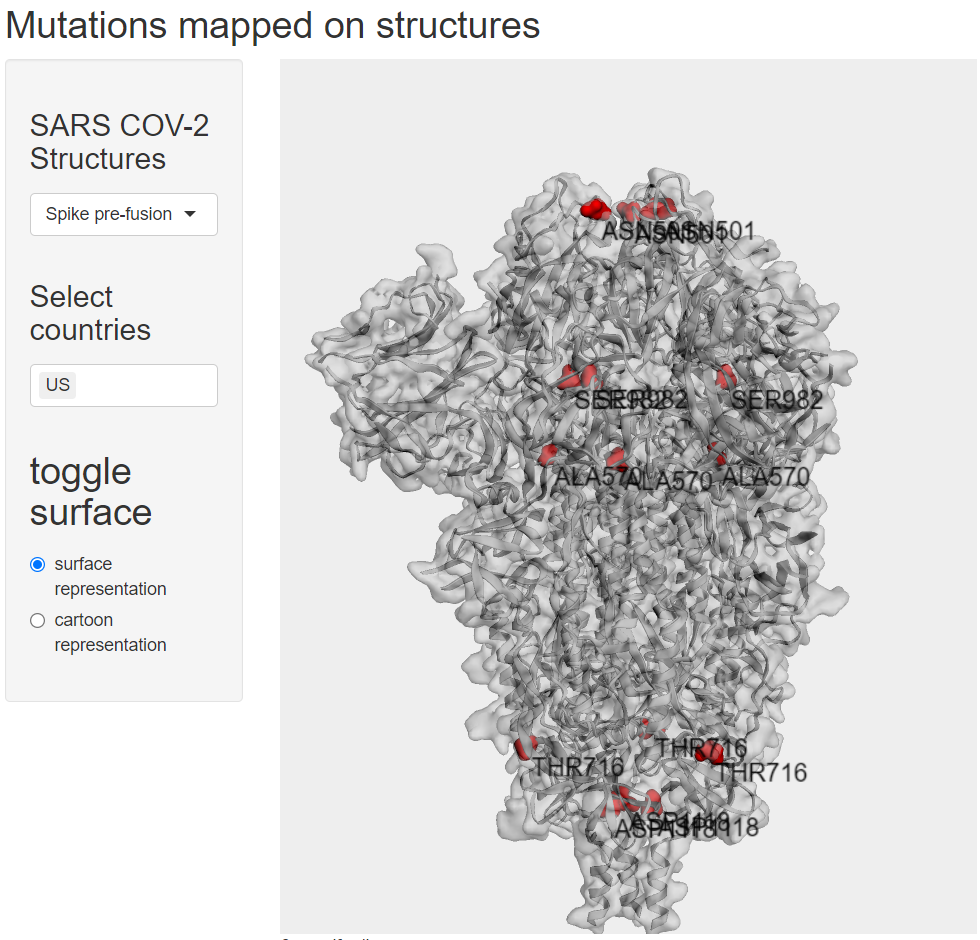

# R Shiny program to map covid mutations on a few selected structures.

This program was written to later be complemented with a country-based  list of prevalent covid mutations. Future plans included showing mutations with different colours based on their prevalence.

## About the scripts

### Files required:

** pdb files of the structures of interest **

### packages to install:

r3dmol
shiny
colourpicker

